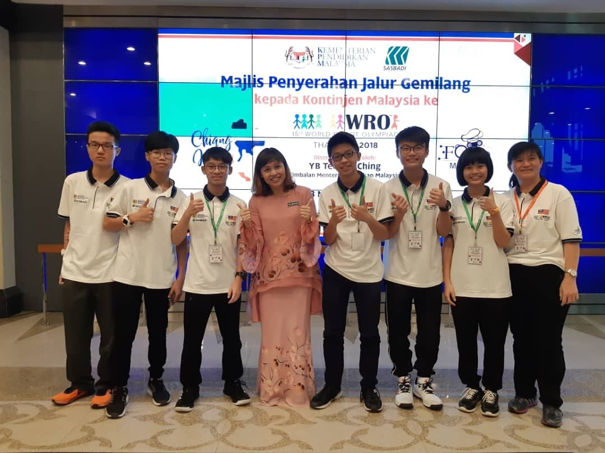

### Hi there! My name is Ennis Lam Si Hoong.😎

I'm currently a student studying in Universiti Teknologi Malaysia and taking the course of Graphics and Multimedia Software.

<h3 align="center">My Education</h3>

My hometown is at Seremban, Negeri Sembilan. My primary school is SJK(C) CHUNG HUA whereby my secondary school is SMJK CHAN WA II. I studied at Kolej Matrikulasi Kejuruteraan Johor for my pre-u.

<h3 align="center">My Award</h3>

I,m a member of Malaysia national Roboctics team which compete in World Robot olympiad. In year 2018, I was given an opportunity to represent Malaysia in World Robot Olympaid 2018 held in Chiang Mai, Thailand.

  

  

<h3 align="left">Connect with me:</h3>

<h3 align="left">Languages and Tools:</h3>

   

&nbsp;

<!--
**Ennis04/Ennis04** is a ✨ _special_ ✨ repository because its `README.md` (this file) appears on your GitHub profile.

Here are some ideas to get you started:

- 🔭 I’m currently working on ...
- 🌱 I’m currently learning ...
- 👯 I’m looking to collaborate on ...
- 🤔 I’m looking for help with ...
- 💬 Ask me about ...
- 📫 How to reach me: ...
- 😄 Pronouns: ...
- ⚡ Fun fact: ...
-->
